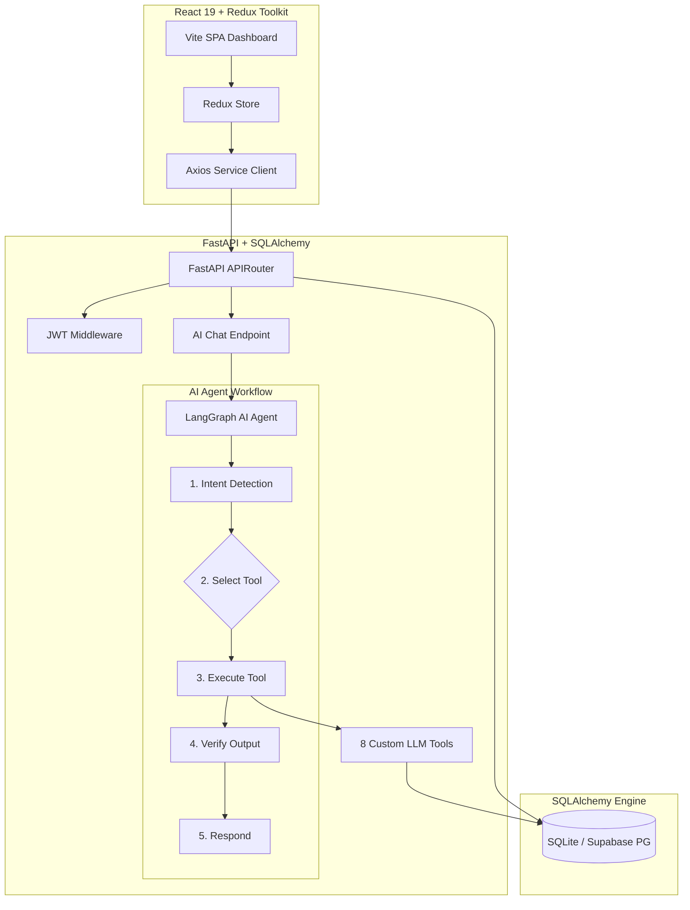
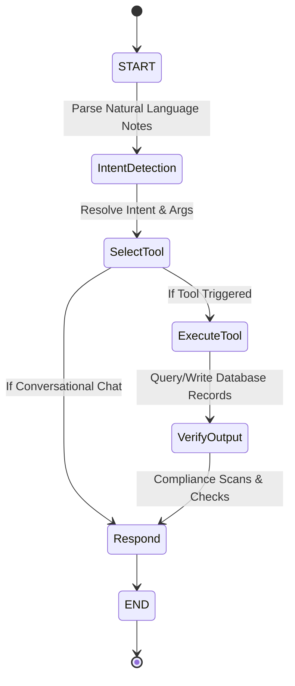

# Aivoa - AI-First Life Sciences CRM

Aivoa is a production-ready, AI-First Customer Relationship Management (CRM) application for Healthcare Professional (HCP) interaction management. Unlike traditional CRUD systems, Aivoa uses natural language parsing and intelligent multi-tool workflows powered by LangGraph, Groq (`gemma2-9b-it`), and a React 19 + Redux Toolkit dashboard.

> [!NOTE]
> To support zero-configuration out-of-the-box, the application defaults to a local SQLite database (`sqlite:///aivoa.db`) and a simulated LLM fallback if environment keys are missing, allowing instant local demonstration.

---

## Architecture Diagram



---

## LangGraph Flow Diagram



---

## Folder Structure

```
aivoa/
├── backend/
│   ├── app/
│   │   ├── ai/
│   │   │   ├── agent.py         # LangGraph state machine flow
│   │   │   ├── tools.py         # The 8 custom database & analytics tools
│   │   │   └── llm.py           # Groq client & mock sandbox fallback
│   │   ├── routers/
│   │   │   ├── auth.py          # Session auth routes (secured via JWT)
│   │   │   ├── hcp.py           # HCP directory queries & CRUD
│   │   │   ├── interaction.py   # Interactions CRUD & CSV exporter
│   │   │   ├── ai.py            # AI Chat & LangGraph tool handlers
│   │   │   └── dashboard.py     # Aggregated Recharts charts endpoints
│   │   ├── config.py            # Settings loader & DB resolver
│   │   ├── database.py          # SQLAlchemy connection sessions
│   │   ├── models.py            # SQLAlchemy tables and relationships
│   │   ├── schemas.py           # Pydantic validation schemas
│   │   ├── auth.py              # Password hashing & JWT dependencies
│   │   └── seed.py              # Mock data seeder on start
│   │   └── main.py              # Uvicorn FastAPI startup entrypoint
│   ├── requirements.txt         # Python packages listing
│   └── .env                     # Local environment settings
└── frontend/
    ├── src/
    │   ├── components/          # Sidebar, Header, RightAssistant
    │   ├── pages/               # Dashboard, Login, HCPList, HCPDetails, LogInteraction, InteractionHistory, Analytics
    │   ├── store/               # Redux Toolkit state slices
    │   ├── index.css            # Tailwind directives & glassmorphic styling
    │   ├── App.tsx              # React Router core routes
    │   └── main.tsx             # React DOM injection mount
    ├── tailwind.config.js       # Utility styling presets
    ├── tsconfig.json            # TypeScript compile configurations
    └── package.json             # NPM dependencies
```

---

## Database Schema Tables

| Table            | Primary Key | Foreign Keys               | Key Attributes / Columns                                                                                    |
| :--------------- | :---------- | :------------------------- | :---------------------------------------------------------------------------------------------------------- |
| **users**        | `id` (UUID) | None                       | `email`, `hashed_password`, `full_name`, `role`, `created_at`                                               |
| **hcps**         | `id` (UUID) | None                       | `name`, `specialty`, `hospital`, `email`, `relationship_score`, `interest_score`, `prescription_likelihood` |
| **products**     | `id` (UUID) | None                       | `name`, `therapeutic_area`, `description`                                                                   |
| **competitors**  | `id` (UUID) | None                       | `name`, `market_product`, `details`                                                                         |
| **materials**    | `id` (UUID) | None                       | `name`, `type`, `url`                                                                                       |
| **interactions** | `id` (UUID) | `user_id`, `hcp_id`        | `interaction_type`, `meeting_date`, `meeting_time`, `sentiment`, `summary`, `notes`                         |
| **follow_ups**   | `id` (UUID) | `hcp_id`, `interaction_id` | `title`, `priority`, `follow_up_date`, `reason`, `status`                                                   |
| **chat_history** | `id` (UUID) | `user_id`                  | `role` (user/assistant), `content`, `created_at`                                                            |
| **audit_logs**   | `id` (UUID) | `user_id`                  | `action_type`, `description`, `created_at`                                                                  |

---

## Environment Variables Configuration

Create a `.env` file in the `/backend` folder matching this layout:

```env
# Database Settings (Leave blank to use default local SQLite)
SUPABASE_URL=
SUPABASE_DB_USER=postgres
SUPABASE_DB_PASSWORD=
SUPABASE_DB_HOST=
SUPABASE_DB_NAME=postgres
SUPABASE_DB_PORT=5432

# Groq API Configuration (Leave blank to run in sandbox simulation mode)
GROQ_API_KEY=

# Security
JWT_SECRET=aivoa-super-secret-key-change-in-production
```

---

## Installation & Running

### Running the Backend

1. Navigate to the backend folder:
   ```bash
   cd backend
   ```
2. Create and activate a Python virtual environment:
   ```bash
   python -m venv venv
   # On Windows (PowerShell):
   .\venv\Scripts\activate
   # On Unix/Mac:
   source venv/bin/activate
   ```
3. Install package dependencies:
   ```bash
   pip install -r requirements.txt
   ```
4. Run the Uvicorn FastAPI server:
   ```bash
   uvicorn app.main:app --reload --port 8000
   ```
   The backend API is now running at [https://aivoa-an49.onrender.com](https://aivoa-an49.onrender.com). The database will automatically initialize and pre-populate seed data on the first start.

### Running the Frontend

1. Navigate to the frontend folder:
   ```bash
   cd ../frontend
   ```
2. Install Node dependencies:
   ```bash
   npm install
   ```
3. Run the development server:
   ```bash
   npm run dev
   ```
   Open [http://localhost:5173](http://localhost:5173) in your web browser.

---

## Demonstrating the AI-First CRM Flow

1. Log in with the pre-seeded credentials:
   - **Email:** `rep@aivoa.com`
   - **Password:** `password123`
2. Navigate to **Log Interaction** on the sidebar.
3. In the right-hand **AI Chat Assistant**, type the following visit log:
   > _"Today I met Dr. Shah. We discussed Atorvastatin-A. He was positive about the drug. I shared the Product Brochure. Call after two weeks."_
4. Click **Send** in the Chat Assistant. Notice:
   - The assistant resolved the **Log Interaction Tool** intent.
   - The fields on the left (HCP, Products, Sentiment, Materials, Follow-up, Notes, Summary) auto-populate instantly.
   - A calendar reminder is created in the database for the follow-up.
5. Click **Save** on the left form to commit the visit log to the archives database!
